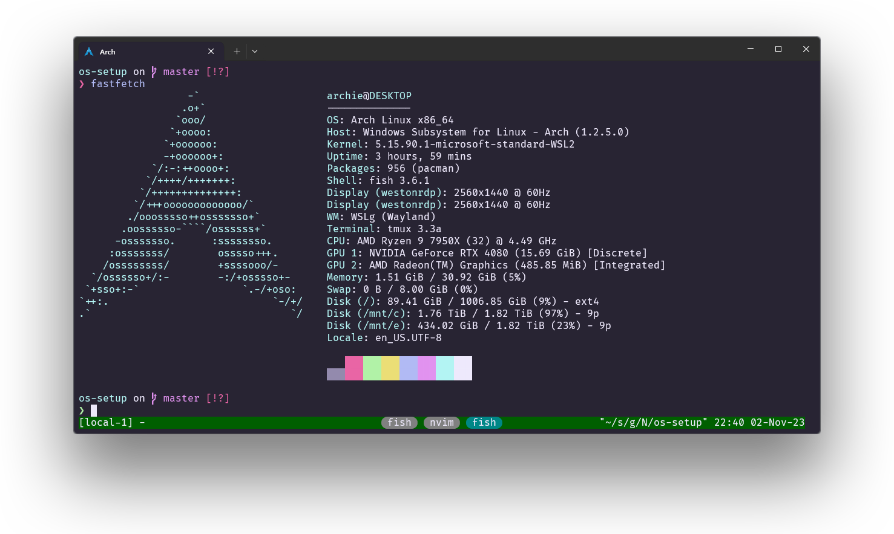

# Dotfiles

This repository contains my collection of dotfiles, including a comprehensive
Fish shell setup and additional tools such as Black, Ruff, Mypy, and more.

<p align="center">

<br/>
WSL Terminal Preview
</p>

## Installation

For a streamlined setup experience, consider using the
[OS Setup](https://github.com/Nachtalb/os-setup) tool. This not only automates
the integration of dotfiles from this repository but also provides a robust
suite of tools and configurations. For a deep dive into the tools included,
refer to our comprehensive
[tooling list](https://github.com/Nachtalb/os-setup/blob/master/TOOLING.md).

> ⚠ Caution: The OS Setup installs various components and might adjust or
> conflict with existing configurations.

To swiftly install:

```bash
bash <(curl https://raw.githubusercontent.com/Nachtalb/os-setup/master/web-install.sh) --noconfirm
```

For those inclined towards a manual touch, the `install.d` folder in the
[OS Setup](https://github.com/Nachtalb/os-setup) repository offers granular
control. access.

## Feature List

### Tools

Explore the custom suite of tools in the bin/ and functions/ folders, curated
for this OS setup to streamline daily tasks and enhance system operations.

|     | Tool                       | Description                                              |
| --- | -------------------------- | -------------------------------------------------------- |
| 📋  | `ccopy` & `cpaste`         | Clipboard interaction (Linux, macOS, Windows/WSL).       |
| 📦  | `pip-extras`               | Show available pip python package extras.                |
| 📦  | `install-pandoc`           | Pandoc dependencies and themes.                          |
| 📦  | `to-pdf`                   | File to PDF conversion with Pandoc.                      |
| 📦  | `extract`                  | Extract common archives.                                 |
| 🔄  | `update-neovim-nightly`    | Update Neovim on Arch.                                   |
| 📤  | `catbox` & `litterbox`     | File uploads.                                            |
| 🌍  | `docker-compose-open`      | Open a service defined in docker compose in the browser. |
| 🚀  | `git tohttp` & `git tossh` | Rewriting Git remotes.                                   |
| 🚀  | `git clear`                | Delete branches merged on a remote.                      |
| 🚀  | `git vlog`                 | Visual git log popout window for rebase sessions.        |
| 🐙  | `gh` & `gl`                | Cloning from GitHub and GitLab.                          |
| ✨  | `vim`                      | Wrapper for Neovim with Session.vim support.             |
| ⚙   | `dotfiles`                 | Manage these dotfiles.                                   |

### Utilities

- 🖥️ Full tmux config and plugins.
- 🔑 SSH, Git, and GnuPG configuration.
- 📦 Tools: Black, Mypy, Isort, XDG-Open, WSL-Open, Ruff, Ruff-LSP.
- 🚀 Shell abbreviations and aliases (many for Git).
- 📚 Auto-setup of PATH for various development tools and environments.
- 🌌 Starship shell integration for a customizable prompt.

## Other Projects

- [OS Setup](https://github.com/Nachtalb/os-setup): An installation script for
  new Arch setups as described above.
- [Git Open](https://github.com/Nachtalb/git-open-rs): A git-open command
  written in Rust, similar to paulirish/git-open.
- [VimConfig](https://github.com/Nachtalb/vimconfig): Neovim configuration with
  Vim-Plug and Coc.nvim support.
- [Licenses API](https://licenses.nachtalb.io/) |
  [GitHub Repository](https://github.com/Nachtalb/licenses_api): An API for
  retrieving software license information, including SPDX ID, permissions,
  conditions, and more.
- [Leeplate](https://leeplate.nachtalb.io/) |
  [GitHub Repository](https://github.com/Nachtalb/leeplate): A privacy-oriented
  alternative frontend for translation providers.
